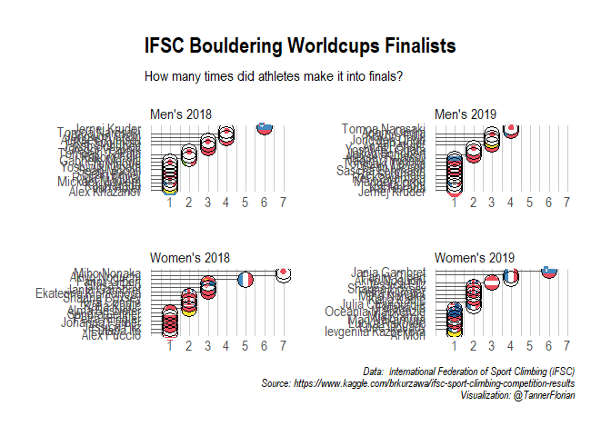

IFSC Sport Climbing Competition Results
================

Dataset from:
<https://www.kaggle.com/brkurzawa/ifsc-sport-climbing-competition-results>

``` r
library(tidyverse)
```

    ## -- Attaching packages --------------------------------------- tidyverse 1.3.0 --

    ## v ggplot2 3.3.3     v purrr   0.3.4
    ## v tibble  3.0.4     v dplyr   1.0.2
    ## v tidyr   1.1.2     v stringr 1.4.0
    ## v readr   1.4.0     v forcats 0.5.0

    ## -- Conflicts ------------------------------------------ tidyverse_conflicts() --
    ## x dplyr::filter() masks stats::filter()
    ## x dplyr::lag()    masks stats::lag()

``` r
library(tidytext)
library(countrycode)
```

    ## Warning: package 'countrycode' was built under R version 4.0.4

``` r
library(ggflags)
library(hrbrthemes)
```

    ## Warning: package 'hrbrthemes' was built under R version 4.0.4

``` r
boulder <- read_csv("Data/boulder_results.csv")
```

    ## 
    ## -- Column specification --------------------------------------------------------
    ## cols(
    ##   `Competition Title` = col_character(),
    ##   `Competition Date` = col_character(),
    ##   FIRST = col_character(),
    ##   LAST = col_character(),
    ##   Nation = col_character(),
    ##   StartNr = col_double(),
    ##   Rank = col_double(),
    ##   Qualification = col_character(),
    ##   `Qualification 1` = col_character(),
    ##   `Qualification 2` = col_character(),
    ##   Semifinal = col_character(),
    ##   Final = col_character(),
    ##   Category = col_character()
    ## )

## Data exploration

  - Contains data from 2018 to 2019
  - 658 athletes
      - No information whether they competed in men’s or women’s
        category
  - 50 athletes in total made it into finals

<!-- end list -->

``` r
columns <- names(boulder)[8:12]
columns
```

    ## [1] "Qualification"   "Qualification 1" "Qualification 2" "Semifinal"      
    ## [5] "Final"

``` r
boulder_results <- boulder %>% 
  pivot_longer(cols = columns, names_to = "Stage") %>% 
  mutate(tops = substr(value, 0, 1),
         zones = substr(value, 3, 3),
         name = str_c(str_to_title(FIRST), str_to_title(LAST), sep= " "),
         year = str_sub(`Competition Date`, -4, -1)) %>% 
  rename(comp = `Competition Title`) 
```

    ## Note: Using an external vector in selections is ambiguous.
    ## i Use `all_of(columns)` instead of `columns` to silence this message.
    ## i See <https://tidyselect.r-lib.org/reference/faq-external-vector.html>.
    ## This message is displayed once per session.

``` r
world_cup_results <- boulder_results %>% 
  filter(str_detect(string = comp, pattern= "IFSC Climbing Worldcup")) # Filter only for Worldcups
```

  - Find finalists and category

<!-- end list -->

``` r
world_cup_finalists <- world_cup_results %>% 
  filter(Rank < 7) %>% # Filter for finalists
  select(name) %>% 
  distinct() %>% 
  arrange(name)

write_csv(world_cup_finalists, "finalists.csv")
gender <- read_csv("gender.csv")
```

    ## 
    ## -- Column specification --------------------------------------------------------
    ## cols(
    ##   gender = col_character()
    ## )

``` r
finalists <- cbind(world_cup_finalists, gender)
finalists$gender[finalists$gender == "m"] <- "Men's"
finalists$gender[finalists$gender == "f"] <- "Women's"
```

``` r
p <- world_cup_results %>% 
  filter(Rank < 7) %>% # Filter for finalists
  left_join(finalists) %>% 
  filter(Stage == "Final") %>% 
  group_by(year, gender, name) %>%
  mutate(finals_count = n(),
         group = str_c(gender, year, sep = " ")) %>% 
  ungroup() %>% 
  mutate(name = reorder_within(name, finals_count, group),
         country = tolower(countrycode(Nation, origin = "ioc", destination = "iso2c"))) %>% 
  select(group, finals_count, name, country) %>% 
  distinct() %>% 
  ggplot(aes(x= finals_count, y = name, country = country)) +
  geom_col(width= 0.2)+ 
  geom_flag() +
  geom_point(shape =1, size = 6) +
  scale_x_continuous(limits = c(0,7), breaks = c(1,2,3,4,5,6,7)) +
  facet_wrap(~group, scales = "free", nrow = 2)+
  scale_y_reordered() +
  labs(y = NULL, x = NULL, subtitle = "How many times did athletes make it into finals?", 
       title = "IFSC Bouldering Worldcups Finalists",
       caption = "Data:  International Federation of Sport Climbing (IFSC)\nSource: https://www.kaggle.com/brkurzawa/ifsc-sport-climbing-competition-results\nVisualization: @TannerFlorian") +
  theme_ipsum() +
  theme(panel.grid.minor.y = element_blank(),
        panel.grid.major.y = element_blank(),
        panel.grid.major.x = element_line(size = 0.2))
```

    ## Joining, by = "name"

``` r
p
```

<!-- -->

``` r
ggsave(p, filename = "Bouldering Worldcup Finalists.png", device = "png", limitsize = F,
       units = "cm", width = 20, height = 24, dpi = 300)
```

``` r
sessionInfo()
```

    ## R version 4.0.3 (2020-10-10)
    ## Platform: x86_64-w64-mingw32/x64 (64-bit)
    ## Running under: Windows 10 x64 (build 18363)
    ## 
    ## Matrix products: default
    ## 
    ## locale:
    ## [1] LC_COLLATE=English_United States.1252 
    ## [2] LC_CTYPE=English_United States.1252   
    ## [3] LC_MONETARY=English_United States.1252
    ## [4] LC_NUMERIC=C                          
    ## [5] LC_TIME=English_United States.1252    
    ## 
    ## attached base packages:
    ## [1] stats     graphics  grDevices utils     datasets  methods   base     
    ## 
    ## other attached packages:
    ##  [1] hrbrthemes_0.8.0  ggflags_0.0.2     countrycode_1.2.0 tidytext_0.3.0   
    ##  [5] forcats_0.5.0     stringr_1.4.0     dplyr_1.0.2       purrr_0.3.4      
    ##  [9] readr_1.4.0       tidyr_1.1.2       tibble_3.0.4      ggplot2_3.3.3    
    ## [13] tidyverse_1.3.0  
    ## 
    ## loaded via a namespace (and not attached):
    ##  [1] Rcpp_1.0.5        lubridate_1.7.9.2 lattice_0.20-41   png_0.1-7        
    ##  [5] assertthat_0.2.1  digest_0.6.27     R6_2.5.0          cellranger_1.1.0 
    ##  [9] backports_1.2.0   reprex_0.3.0      evaluate_0.14     httr_1.4.2       
    ## [13] pillar_1.4.7      gdtools_0.2.3     rlang_0.4.10      readxl_1.3.1     
    ## [17] rstudioapi_0.13   extrafontdb_1.0   Matrix_1.2-18     rmarkdown_2.6    
    ## [21] extrafont_0.17    munsell_0.5.0     broom_0.7.5       compiler_4.0.3   
    ## [25] janeaustenr_0.1.5 modelr_0.1.8      xfun_0.20         systemfonts_1.0.1
    ## [29] pkgconfig_2.0.3   base64enc_0.1-3   htmltools_0.5.0   tidyselect_1.1.0 
    ## [33] XML_3.99-0.6      fansi_0.4.2       crayon_1.3.4      dbplyr_2.0.0     
    ## [37] withr_2.3.0       SnowballC_0.7.0   grid_4.0.3        Rttf2pt1_1.3.8   
    ## [41] jsonlite_1.7.2    gtable_0.3.0      lifecycle_0.2.0   DBI_1.1.0        
    ## [45] magrittr_2.0.1    scales_1.1.1      tokenizers_0.2.1  cli_2.2.0        
    ## [49] stringi_1.5.3     farver_2.0.3      grImport2_0.2-0   fs_1.5.0         
    ## [53] xml2_1.3.2        ellipsis_0.3.1    generics_0.1.0    vctrs_0.3.6      
    ## [57] tools_4.0.3       glue_1.4.2        hms_1.0.0         jpeg_0.1-8.1     
    ## [61] yaml_2.2.1        colorspace_2.0-0  rvest_0.3.6       knitr_1.30       
    ## [65] haven_2.3.1
